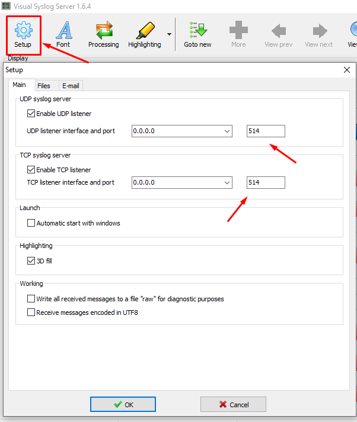
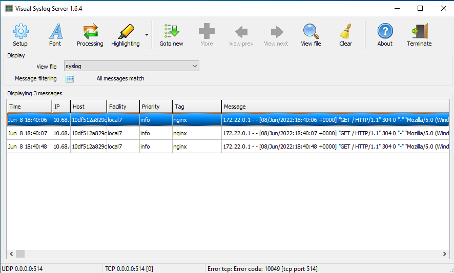

# **Centralize your service logs**

## **Nginx**
Here we have some options, you can use the default feature that nginx has to send to syslog, or use the driver provided by docker, the following example uses nginx's own feature, in case that first method doesn't work to you, in the example used for PHP you can also use in your nginx as it is a docker feature.

Using an external application **(Visual Syslog Server)** to centralize your logs, facilitating the search and collection of these logs.

* Create your service.
* Download the Syslog application. [link](https://maxbelkov.github.io/visualsyslog/)
* Install and run.

Having everything ready, now just direct the logs to the application, there are two ways, if you are on another network, you will need to direct your ``.conf`` the direct IP of the network to which the syslog is connected.

[site.conf](docker/nginx/site.conf)
```sh
server {
 
        listen 8080;
        server_name localhost;
 
        access_log syslog:server=1.1.1.1; ## like in this example
        error_log syslog:server=1.1.1.1;

}
```

If they are on the same network, the following example might work, it will be directed to the default syslog port **514**, which can be changed, below I will show you how.


[site.conf](docker/nginx/site.conf)
```sh
server {
 
        listen 8080;
        server_name localhost;
 
        access_log syslog; ## like in this example
        error_log syslog;

}
```


Syslog will receive log from any IP that points to it, if you don't specify a single one it should accept to receive it, which is good if you have multiple services and want to centralize your logs.

* It is possible to change the port by adding it to your [site.conf](docker/nginx/site.conf) and modifying the default port in the app settings!



Now your logs should be arriving in the application, by default in *tag*, the service that sent it should appear, as in the following example.



#

## **PHP-FPM and OTHERS**

Remember this configuration may be a solution for other services, Nginx and PHP-FPM are just examples used to extract your logs.

You should follow some steps, start by adding the following lines in your PHP-FPM in [docker-compose.yml](docker-compose.yml) <= check the original file.

```sh
...
    logging:
      driver: syslog
      options:
        syslog-address: "udp://1.1.1.1:514"
        syslog-format: rfc3164
        tag: php
...
```

Moving on to the next step, in your PHP `.conf`
[custom-phpfpm.conf](docker/php-fpm/custom-phpfpm.conf) you will need to add the following instructions.

 ```ini
[global]
error_log = /proc/self/fd/2

[www]
access.log = /proc/self/fd/2
 ```

Now your logs should be centered correctly.